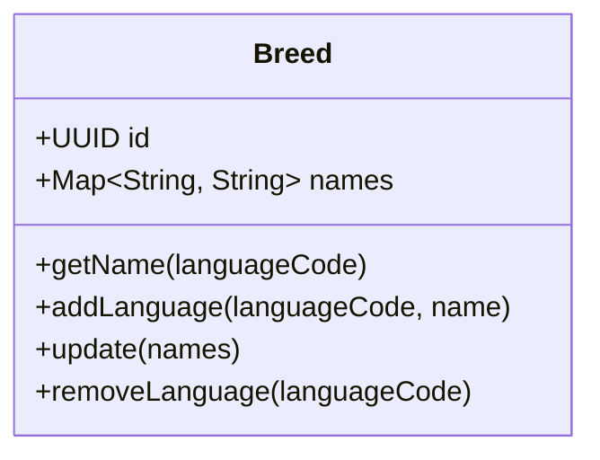

# Breed (Порода)

Справочник `Breed` хранит информацию о кинологических породах собак. 

Так как платформа может использоваться в разных странах, породы поддерживают мультиязычные названия. Каждая [[Dog]] ссылается на этот справочник.

## Диаграмма структуры

## Бизнес-правила
- **Обязательный язык**: Порода **обязана** иметь название на английском языке (`en`). Это fallback-язык системы. Удалить английский перевод невозможно.
- **Длина названия**: Название породы на любом языке должно быть не короче 2 символов (после обрезки пробелов).
- **Fallback**: Если система запрашивает перевод породы на язык (например, `uk`), которого нет в базе, возвращается английское название.
