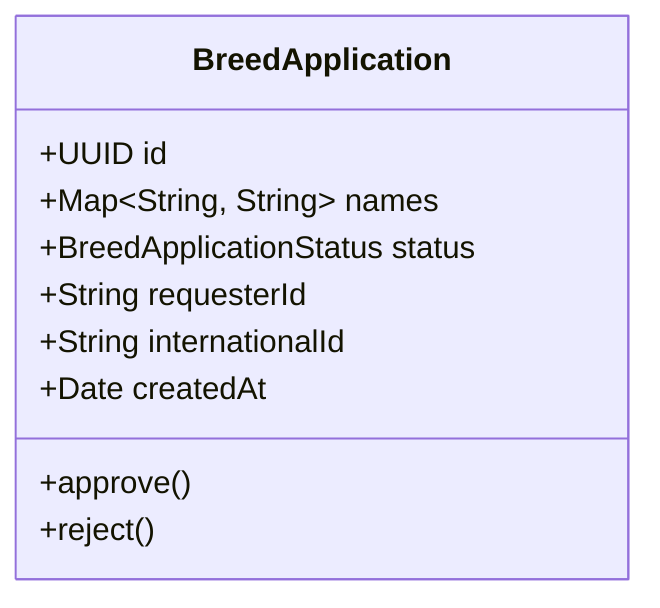

# BreedApplication (Заявка на добавление породы)

Сущность `BreedApplication` представляет собой заявку на добавление новой породы в справочник [[Breed]].
Она позволяет пользователям предлагать новые породы, которые затем рассматриваются модераторами системы.

## Диаграмма структуры

## Бизнес-правила
- **Обязательный язык**: При создании заявки обязательно должно быть указано название породы на английском языке (`en`).
- **Жизненный цикл**: Заявка создается со статусом `pending`. Модератор может одобрить (`approve()`) или отклонить (`reject()`) её. Изменить статус можно только для заявок, которые находятся в статусе `pending`.
- **Идентификация**: Содержит `requesterId` (кто предложил породу) и `internationalId` (международный идентификатор, если есть).
