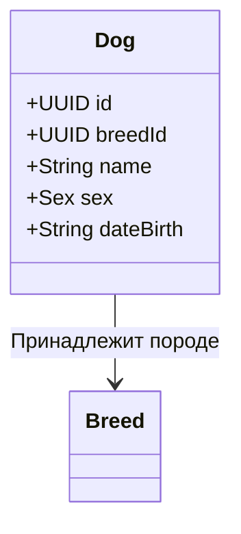

# Dog (Собака)

Агрегат `Dog` является ядром функционала управления животными в платформе. 

Каждая собака строго привязана к своей породе ([[Breed]]). В перспективе собака также будет ссылаться на [[Organization]] (клуб, в котором она зарегистрирована) и [[User]] (владелец/хендлер).

## Диаграмма структуры

## Бизнес-правила
- При создании собаки обязательно указать реальный `breedId`.
- **Пол (Sex)**: Строго ограничен значениями `'male'` или `'female'`.
- **Дата рождения (DateBirth)**: Должна строго соответствовать формату `dd-mm-yyyy`.

## Перспективы развития
Согласно архитектурному плану, агрегат `Dog` в будущем обрастет следующими связями:
- Родословная: ссылки на собак-родителей (Sire и Dam).
- Связь с внешними контактами (например, заводчик из другой страны).
- Связь с [[Organization]].
