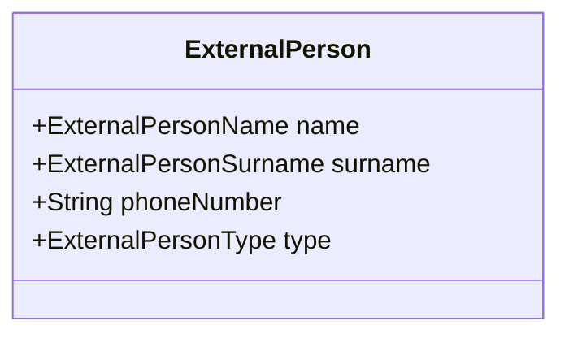

# ExternalPerson (Внешнее контактное лицо)

Сущность `ExternalPerson` представляет собой информацию о людях, которые не являются пользователями системы (не имеют аккаунта), но связаны с собаками ([[Dog]]).
Обычно это заводчики (breeder), предыдущие владельцы (previousOwner) или продавцы (seller) из других стран или клубов.

## Диаграмма структуры

## Бизнес-правила
- **Типы (ExternalPersonType)**: Внешнее лицо может иметь один из следующих типов:
  - `breeder`: Заводчик собаки.
  - `previousOwner`: Предыдущий владелец собаки.
  - `seller`: Продавец собаки.
- **Использование**: Эта сущность не имеет уникального идентификатора (ID) и предназначена для использования как вложенный объект (Value Object или часть другой сущности) в контексте родословной или истории владения [[Dog]].
