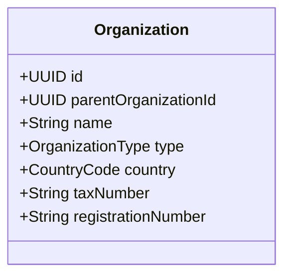

# Organization (Клуб / Организация)

Организация является корневой сущностью для мультитенантности (Multitenancy) в платформе Paw Cloud Solution. 

Все данные в системе привязаны к конкретной Организации. Это позволяет главному управлению (национальной федерации) и локальным кинологическим клубам работать в одной системе, не пересекаясь данными там, где это не нужно. Каждая сущность [[User]] жестко привязана к одной организации. В будущем [[Dog]] также будет привязана к клубу.

## Диаграмма структуры

## Бизнес-правила
- **Иерархия**: 
  - Тип `international` (Международная организация) **не может** иметь `parentOrganizationId` (он находится на вершине иерархии).
  - Любой другой тип (например, `headquarter`, `club`, `kennel`, `training_ground`) **обязан** ссылаться на родительскую организацию.
- **Страна**: Каждая организация привязана к стране (`CountryCode`). Это критично для дальнейшей валидации локальных налоговых и регистрационных номеров (ИНН, ЕГРПОУ).

## Value Objects
- `OrganizationName`: Длина от 3 до 100 символов.
- `OrganizationType`: `international`, `headquarter`, `club`, `kennel`, `training_ground`.
