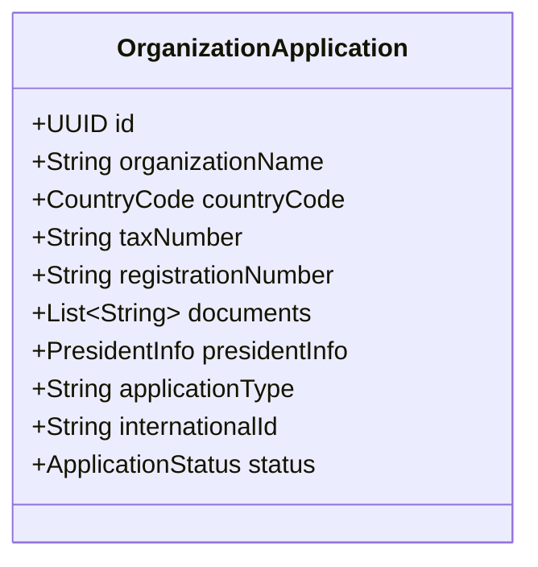

# OrganizationApplication (Заявка на регистрацию)

Сущность `OrganizationApplication` представляет собой заявку на создание Главного Управления (Headquarter) или Международной Организации (International). 
Она используется в процессе онбординга (Onboarding), чтобы модераторы или `superAdmin` могли проверить легальные документы и одобрить заявку до того, как организация фактически появится в системе.

## Диаграмма структуры

## Бизнес-правила
- **Жизненный цикл:** Заявка создается в статусе `pending` (Ожидает). Глобальный администратор (`superAdmin`) может либо одобрить её (`approve()`), либо отклонить (`reject()`).
- **Президент:** Вместе с заявкой передаются данные будущего президента. При одобрении заявки в системе автоматически создается новая [[Organization]] (тип `headquarter` или `international`) и первичный [[User]] (президент с соответствующей ролью), привязанный к ней.
- **Документы:** К заявке обязательно прикрепляются ссылки на уставные документы для проверки валидности кинологической регистрации.
