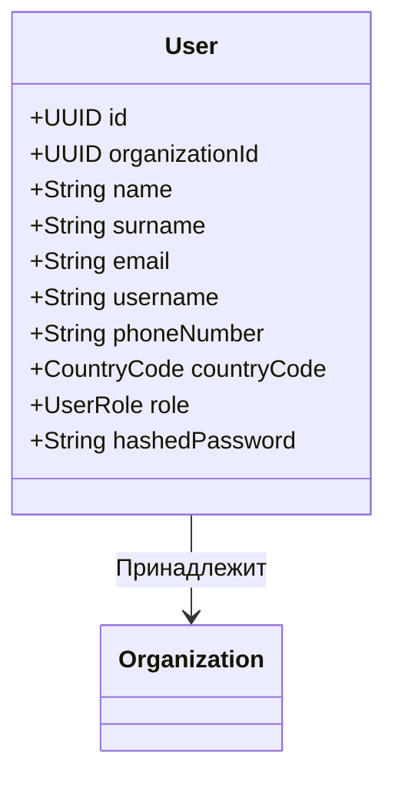

# User (Пользователь)

Сущность `User` описывает сотрудников клубов и участников кинологических организаций.

Любой пользователь в системе всегда привязан к конкретной [[Organization]].

## Диаграмма структуры

## Бизнес-правила и Роли
- `roleManager`: Администратор или директор клуба. Только этот пользователь может изменять роли других пользователей (вызывать `changeRoleBy`).
- `employee`: Сотрудник клуба.
- `member`: Обычный член клуба (владелец собаки).

**Ограничения ролей:**
- Пользователь **не может** сам себе изменить роль.
- Обычные сотрудники и участники не могут менять роли другим.
- Нельзя назначить ту же самую роль, которая уже есть у пользователя.

## Value Objects
- `Username`: Минимум 7 символов.
- `PhoneNumber`: Нормализуется и приводится к международному формату E.164 с использованием `libphonenumber-js` (зависит от `CountryCode`).
- `PasswordHash`: Ожидается захешированная строка (длина >= 20 символов).
