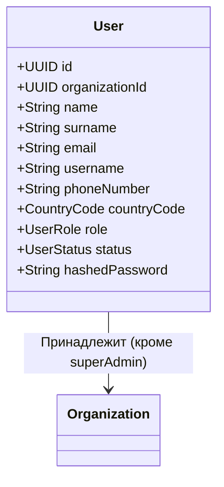

# User (Пользователь)

Сущность `User` описывает сотрудников клубов и участников кинологических организаций.

Любой пользователь в системе всегда привязан к конкретной [[Organization]], за исключением системных администраторов (`superAdmin`).

## Диаграмма структуры

## Бизнес-правила и Роли
- `superAdmin`: Глобальный администратор платформы. Не привязан к конкретной организации, имеет права на одобрение заявок на HQ ([[OrganizationApplication]]) и управление платформой.
- `roleManager`: Президент, директор или администратор клуба. Только этот пользователь может изменять роли других пользователей внутри своей организации (вызывать `changeRoleBy`) и одобрять заявки сотрудников.
- `employee`: Сотрудник клуба (кинолог, бухгалтер, менеджер).
- `member`: Обычный член клуба (владелец собаки).

## Жизненный цикл (Статусы)
- `pending_approval`: При регистрации обычных сотрудников и участников, они попадают в систему с этим статусом. Они не могут совершать активных действий, пока президент или менеджер не вызовет `approve()`.
- `active`: Активный пользователь.
- `suspended`: Заблокированный пользователь.

**Ограничения ролей:**
- Пользователь **не может** сам себе изменить роль.
- Обычные сотрудники и участники не могут менять роли другим.
- Нельзя назначить ту же самую роль, которая уже есть у пользователя.

## Value Objects
- `Username`: Минимум 7 символов.
- `PhoneNumber`: Нормализуется и приводится к международному формату E.164 с использованием `libphonenumber-js` (зависит от `CountryCode`).
- `PasswordHash`: Ожидается захешированная строка (длина >= 20 символов).
